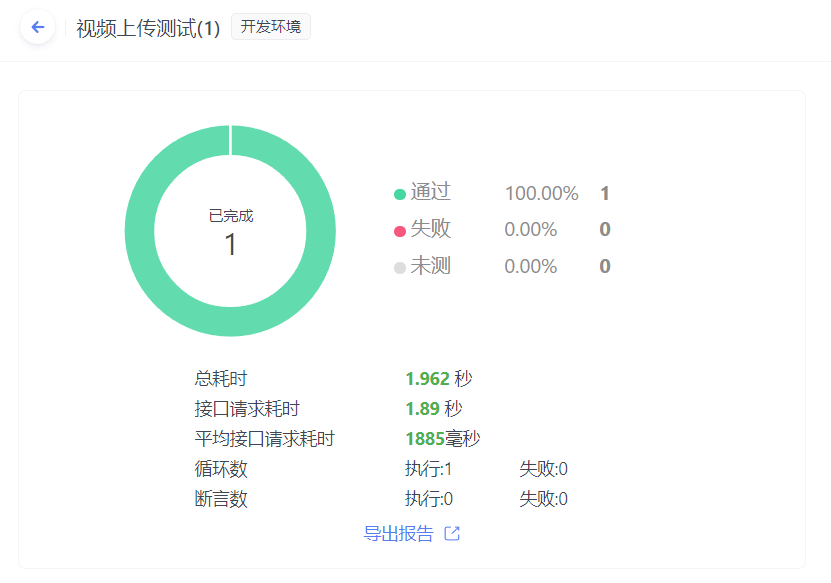

# 极简版抖音——Go To Success

# 一、项目介绍

**基于 “Gin HTTP框架 + Gorm数据库框架” 的第六届字节跳动青训营—抖音极简版项目**

- 项目地址:https://1024code.com/codecubes/ystkokb
- Github 地址：https://github.com/2230307855/Go_to_success_douyin

# 二、项目分工

| 团队成员 | 主要贡献                                                     |
| -------- | ------------------------------------------------------------ |
| 史成龙   | 负责开发与测试，主要负责完成jwt的全局认证与解析、完成oss视频流上传的的接口对接与实现、视频发布和关注操作等接口的开发与测试工作。测试接口的边界条件、HTTP的响应信息的正确性和逻辑执行顺序等。 |
| 徐锦桐   | 负责项目框架的选择，主要负责完成feed视频流、用户注册和登录、用户信息的查询、点赞操作和喜欢列表的查询、粉丝列表和好友列表的查询等接口的开发。使用vipper完成从不同配置文件的读取操作，为以后重构成微服务项目打下基础。使用zip完成日志的分级写入。 |
| 林厚忠   | 主要负责发送消息和聊天记录的实现。                           |
| 赵书楠   | 主要负责评论操作和评论列表的实现。                           |

# 三、项目实现

## 3.1 技术选型与相关开发文档

- **接口说明**
  
  本项目包含三大类接口：基础接口、互动接口、社交接口。采用MVC架构以及1024Code在线运行部署的方式。存储空间会随业务使用而自动增长，1 台1024Code服务器，项目中所需要的数据库是云数据库，所需的存储空间会在oss的服务器中自动随着业务不断增长。
- **接口文档**
  
  [ApiFox开发文档](https://www.apifox.cn/apidoc/shared-7b33652d-6080-41bb-a70e-7a165d55daae/api-63185966)

## 3.2 架构设计

### 3.2.1 架构方案

 本项目是基于前后端分离模式开发的后端项目，采用MVC架构。

**项目的各层结构与作用**

- controller层：接收来自对应接口的HTTP请求，并进行响应的处理，服务向下调用dao层提供的数据存取服务
- dao层：用来操作数据库，对用户要保存的数据或者产生的数据进行处理与存储
- model层：定义了与实体相对应的结构，将实体与数据库表和响应信息关联起来
- view层：在前后端分离的模式中，view不再由后端渲染返回，而是仅仅由前端控制器进行相应处理接口的映射，然后直接由接口进行信息处理并返回信息，最后前端根据数据进行页面渲染。

**业务处理流程**

- 前端根据相应的操作向指定的后端服务接口发送请求
- 后端的请求控制器，进行接口映射的匹配，找到匹配接口后，交给对应的controller处理，若没有相应的接口映射就由统一访问异常返回404路由未定义错误
- 检查必要的信息，如权限是否存在、是否过期等，检验操作是否在定义的操作集里
- 请求的controller调用utils工具或者dao等的数据处理服务进行业务处理
- controller调用响应的model进行HTTP的数据响应，将数据和HTTP信息返回给前端

### 3.2.2 架构图

## 3.3 项目代码介绍

### 3.3.1 项目所用技术栈

- Gin：对HTTP请求进行处理和响应
- JWT：用于用户鉴权、生成并解析token
- Gorm：MySQL的ORM操作框架，提供实体结构到表的映射与存取操作，可以减少SQL的编写、简化数据库操作
- Viper：读取项目的配置文件
- Zap：处理与保存项目日志
- OSS-SDK：处理对象存储与静态数据的上传

### 3.3.2 项目目录及对应功能介绍

| **目录**   | **功能**                                             | **说明**                       |
| ---------- | ---------------------------------------------------- | ------------------------------ |
| config     | 存放项目的配置文件                                   | 用于项目配置                   |
| controller | 对访问的接口进行处理与相应                           | 对应接口的业务处理             |
| dao        | 对相应服务的功能进行数据库操作                       | 数据库操作                     |
| models     | 提供项目的实体结构和数据库映射模型和HTTP特定响应模型 | 存放实体结构模型与数据响应模型 |
| routes     | 提供接口的定义和controller处理映射的匹配             | 服务接口的API定义              |
| upload     | 静态资源数据上传到OSS的中转站                        | 静态数据暂存                   |
| utils      | 为项目提供操作工具（JWT、OSS、日志等）               | 提供项目的工具集               |
| log        | 存放项目日志信息                                     | 存放项目日志信息               |

# 四、测试结果

## 4.1 功能测试

|  功能项  | 功能需求      | 测试点                                          |        模块        |  结果  |
|:-----:|-----------|----------------------------------------------|:----------------:|:----:|
| 基础功能项 | 视频 Feed 流 | 支持所有用户刷抖音，视频按投稿时间倒序推出                        |      获取视频列表      | 正确运行 |
|       | 视频投稿      | 支持登录用户自己拍视频投稿                                |       发布视频       | 正确运行 |
|       | 个人主页      | 支持查看用户基本信息和投稿列表，注册用户流程简化                     |        注册        | 正确运行 |
|       |           |                                              |        登录        | 正确运行 |
|       |           |                                              |       个人信息       | 正确运行 |
| 方向功能项 | 喜欢列表      | 登录用户可以对视频点赞，在个人主页喜欢Tab 下能够查看点赞视频列表           |      获取喜欢列表      | 正确运行 |
|       |           |                                              |        点赞        | 正确运行 |
|       |           |                                              |       取消赞        | 正确运行 |
|       | 用户评论      | 支持未登录用户查看视频下的评论列表，登录用户能够发表评论                 |      获取评论列表      | 正确运行 |
|       |           |                                              |       新增评论       | 正确运行 |
|       |           |                                              |       删除评论       | 正确运行 |
|       | 关系列表      | 登录用户可以关注其他用户，能够在个人主页查看本人的关注数和粉丝数，查看关注列表和粉丝列表 |        关注        | 正确运行 |
|       |           |                                              |        取关        | 正确运行 |
|       |           |                                              | 获取关系列表（关注、粉丝、朋友） | 正确运行 |

## 4.2 性能测试（展示部分接口）

### 4.2.1 视频上传测试

### 4.2.2 关注测试

# 五、项目总结与反思

## 5.1 项目问题与优化

| **问题**                                                     | **问题分析**                                                 | **是否优化与解决** | **解决方案**                                                 |
| ------------------------------------------------------------ | ------------------------------------------------------------ | ------------------ | ------------------------------------------------------------ |
| 从token解析的claims中得到uint类型的用户id                    | 从token的claims中获得用户的id的时候进行返回一直报错“无法确定的类型”，什么类型都无法确定，更无法转换 | 是                 | 使用Go的类型断言，将获得的id转换成需要的类型进行返回         |
| 投稿接口在上传视频的时候，无法从本地直接上传到OSS服务器      | oss的sdk支持的是项目的服务路径上传，不支持文件的本地绝对路径上传，因为这样会不安全 | 是                 | 使用中转上传策略，将本地文件先利用传统文件上传先上传到项目的upload目录，然后再从项目的upload目录存到OSS，存储过程完成后，再把项目的upload目录的静态文件删除 |
| 无法实现封面的上传                                           | 投稿的参数中未给出封面文件的数据                             | 是                 | 视频上传全部使用统一的默认封面                               |
| 无法实现个人头像的定义                                       | 没有用户信息的编辑接口                                       | 是                 | 用户统一使用默认的头像                                       |
| 关注操作出现多次点击取消/关注按钮的时候同一个人会多次出现在关注列表中 | 关注列表的处理逻辑不正确                                     | 是                 | 关注应该从关系表中查出本用户和关注用户是否存在一条关注记录，而不是仅仅看本用户的关注数是否大于0 |
| 关注列表的响应模型中没有is_follow字段（                      | 没有is_follow字段的时候，关注列表返回的时候就不知道是否关注了列表中的用户 | 是                 | 创建新的响应模型，使用embeded将原来响应模型嵌入到新的模型中，再加入is_follow属性即可（字段根据关系的查询结果进行填充） |
| 点赞错误                                                     | 点赞的时候刷新了视频，红心会变灰，然后能重复点赞             | 是                 | 在视频流的返回中添加Is_favorite属性，然后每次刷视频的时候给Is_favorite赋值 |

## 5.2 架构演进的可能性

- 不足之处
  -  本项目采用的是改进型的MVC架构——前后端分离开发模式，但是这种模式也有很多不足之处，比如项目无法分模块由不同的团队独立开发，访问量激增易达到性能峰值，从而降低服务质量。项目的服务也可以加入缓存机制，这样可以保证高访问量的数据可以节省下更多的服务性能。
- 演进的可能方案
  -  项目未来会朝着微服务的方式发展，因为一个单体项目的某个服务崩溃可能会造成整个服务不可用，而微服务的不同服务模块可由不同的团队采用不同的技术方案进行实现与部署，每个服务模块也可以根据业务的压力自行调整业务的灵活扩展

  -  微服务中不同的服务模块之间的调用也将使用RPC来实现，RPC是一种通过网络在不同的服务之间进行通信的机制。它允许一个服务请求另一个服务提供的功能，就像调用本地函数一样简单。通过RPC，微服务可以以分布式的方式协同工作，并通过发送请求和接收响应来进行通信。这种通信方式可以跨越不同的语言和平台，使得微服务架构更具灵活性和可伸缩性。

  -  微服务的架构中还可能会加入消息队列如RocketMQ或者RabbitMQ，使得不同服务之间可以异步通信、解耦模块之间的关联。消息队列可以作为一个缓冲区，帮助平衡不同速度的服务之间的数据流量。当某个服务的请求过载时，消息队列可以缓冲一部分请求，起到缓冲和削峰的作用

  -  使用Redis或者MemoryCache等，将数据查询缓存起来可以使得用户多次请求同一个资源时，浏览器可以直接从本地缓存中获取资源，减少了网络开销和延迟时间，显著提高系统的响应速度和并发能力

## 5.3 总结与反思

- 先设计后实现：如果自己想到哪里就做哪里，这样的话，可能自己做完了业务，但是缺乏完备的接收响应和处理逻辑，比如返回用户的关注列表，只看到要返回所关注的用户的信息列表，当做完之后发现一个字段是需要新设置的，这样之前的代码路径几乎都要重新再改一遍，相当于做了两倍的工作。若开发过程出现错误，对整个项目来说将是灾难级别的，因为没有控制的开发可能引起模块的关联出错
- 代码简洁与规范，在多人协作开发的过程中，不可避免地需要大量地、重复性地阅读队员的代码，由于编码风格和个人习惯的差异，在阅读过程中会经常出现阅读和理解上的障碍。因此简洁统一地开发、命名和提交规范有助于项目的快速、高效开发和队员之间的有效沟通与配合
- 错误处理，对于每个可能产生错误的函数最好获取其返回的错误，并输出错误相关信息，既可以方便调试又可以避免后续出现意料之外的情况。但是要小心错误输出时敏感信息的泄露，可能会被攻击者利用
- 配置读取，应该在一开始就弄好了从不同文件中读取配置文件，这样多人开发的时候只需要切换到自己配置文件就好了，不用到每个配置的地方修改成自己的配置信息。
- 框架的选择和制定，一开始就制定好项目的框架，这样方便以后多人协作开发，到时候哪个文件是干什么的对应的人就写对应的代码就OK了，这样方便维护和开发。

# 六、其他补充资料

- 微服务架构图

